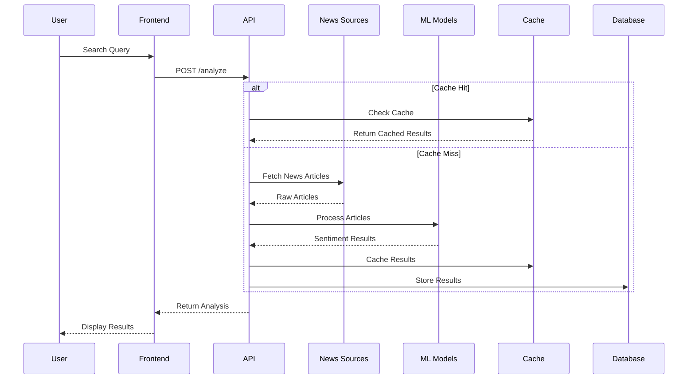

<div align="center">

# 📊 News Sentiment Analyzer

[](https://choosealicense.com/licenses/mit/)
[](https://www.python.org/)
[](https://reactjs.org/)
[](https://flask.palletsprojects.com/)

A modern web application that analyzes sentiment patterns across news articles using advanced NLP techniques and machine learning models.

</div>

## System Architecture 🏗️

### High-Level Architecture


### Data Flow


## Features ✨
- Real-time sentiment analysis using multiple models:
  - Flair (default model)
  - Custom fine-tuned RoBERTa
  - VADER
  - TextBlob
  - BERT & DistilBERT
- Multi-source news aggregation from 15+ major news outlets
- Interactive visualization of sentiment distribution
- Advanced filtering by time range and news sources
- Word cloud generation for key topics
- Identification of most positive/negative phrases
- Model comparison functionality

### Sentiment Models
| Model | Type | Use Case |
|-------|------|----------|
| Flair | Deep Learning | Default analyzer |
| RoBERTa | Fine-tuned Transformer | News-specific analysis |
| VADER | Rule-based | Quick analysis |
| TextBlob | Lexicon-based | Basic sentiment |
| BERT/DistilBERT | Transformer | Complex context |

## Tech Stack 🛠️
### Frontend
- React.js with Hooks
- Chart.js for data visualization
- Material-UI components
- React-Select for dropdowns
- Axios for API requests

### Backend
- Flask RESTful API
- Multiple NLP models:
  - Flair
  - Hugging Face Transformers
  - NLTK
  - TextBlob
- BeautifulSoup4 for web scraping
- News API integration

## Sentiment Analysis Models 🤖
### Core Models
- **Flair**: Deep learning-based classifier (default)
- **RoBERTa**: Fine-tuned for news sentiment
- **BERT/DistilBERT**: Custom-trained on news dataset
- **VADER**: Rule-based sentiment analysis
- **TextBlob**: Lexicon-based approach

### Model Training
- Custom dataset of balanced news samples
- Fine-tuned transformers architecture
- 3-class classification (Positive/Negative/Neutral)
- Evaluation metrics for model comparison

### Benchmark Results
| Model | Accuracy | Speed (ms) | Memory (MB) |
|-------|----------|------------|-------------|
| Flair | 91.2% | 245 | 550 |
| RoBERTa | 93.5% | 312 | 1240 |
| VADER | 84.7% | 12 | 32 |
| BERT | 92.8% | 285 | 680 |

## Getting Started 🚀
1. Clone the repository:
```bash
git clone https://github.com/yourusername/news-sentiment-analyzer.git
```

2. Install frontend dependencies:
```bash
cd news-sentiment-analyzer/frontend
npm install
```

3. Install backend dependencies:
```bash
cd ../backend
pip install -r requirements.txt
```

4. Set up your News API key:
```python
# In app.py
newsapi_key = "your_api_key_here"
```

5. Start the servers:
```bash
# Backend
python app.py
# Frontend (in a new terminal)
npm start
```

## Usage 💡
1. Enter a keyword or topic in the search field
2. Select desired news sources from the dropdown
3. Adjust the time range using the slider
4. Choose between different sentiment models
5. View analysis results and visualizations

## API Endpoints 🔌
### Endpoints
| Parameter | Type | Description |
|-----------|------|-------------|
| text | string | Text to analyze |
| model | string | Model to use |
| sources | array | News sources |

## Future Improvements 🔮
- Real-time analysis updates
- Sentiment trend tracking over time
- Additional language support
- Advanced filtering options
- Customizable visualization options

## License 📄
MIT License - See [LICENSE](LICENSE) for details.

## Contributing 🤝
Pull requests welcome! See [CONTRIBUTING.md](CONTRIBUTING.md) for guidelines.

